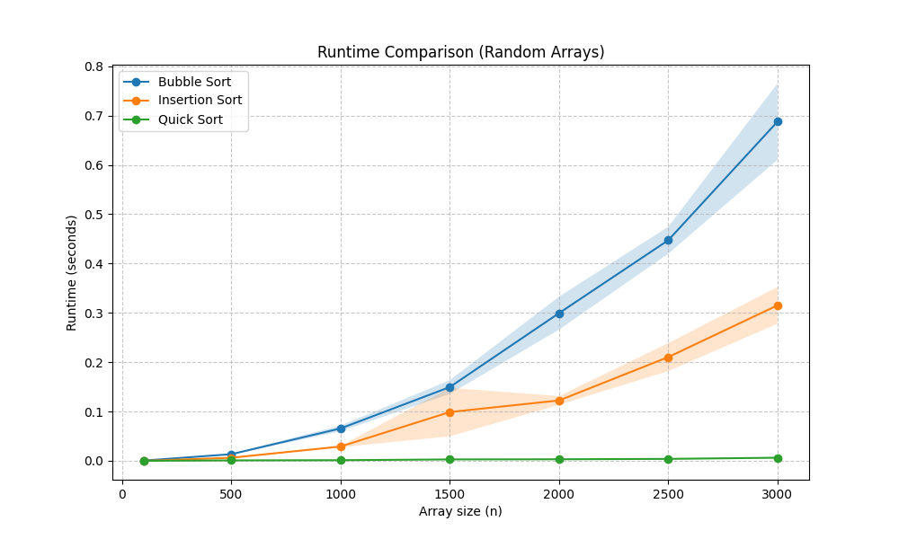
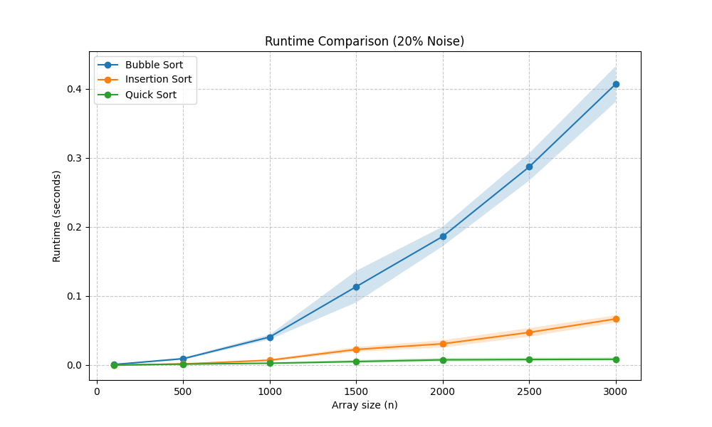

# Data Structures HW1 - Sorting Assignment

**Student Name:** Eitan Haim Levi - 212386932, Tohar Asaf - 207828039

## Selected Algorithms
The following sorting algorithms are the main focus of our comparison:
1. **Bubble Sort** - A simple $O(n^2)$ algorithm that includes an early termination optimization for sorted data.
2. **Insertion Sort** - Another $O(n^2)$ algorithm that is highly efficient on nearly-sorted data.
3. **Quick Sort** - A divide-and-conquer $O(n \log n)$ average-case algorithm, implemented here with the rightmost element as the pivot.

*(Note: Selection Sort and Merge Sort are also implemented and available via the CLI for broader comparisons, but our core experiments focus on the three algorithms above).*

## Results and Analysis

### Part A & B: Random Arrays



**Explanation of Results (result1.png):**
*As seen in the graph, **Quick Sort**, performs drastically better on random, unstructured data. It effortlessly handles larger array sizes due to its $O(n \log n)$ average time complexity. In sharp contrast, the simpler **Bubble Sort** and **Insertion Sort** scale poorly as the array size $N$ increases. They exhibit their expected $O(n^2)$ average and worst-case running times, requiring significantly more time as sizes grow.*

---

### Part C: Nearly Sorted Arrays (Partial Noise)



**Explanation of Results - Nearly Sorted Data:**

*   **Insertion Sort**: Shows a massive improvement. Since the data is mostly ordered, the inner `while` loop stops almost immediately, pushing the runtime close to $O(n)$.
*   **Bubble Sort**: Surprisingly, it remains quite slow. Because our noise is generated by random swaps across the entire array, some small numbers randomly end up at the very end. Since Bubble Sort only moves small numbers one step to the left per pass, even a single small number at the end forces the algorithm to do almost all $O(N)$ outer passes, resulting in roughly $O(n^2)$ runtime.
*   **Quick Sort**: Remains highly efficient. Normally, picking the last element as the pivot in a sorted array degrades performance to $O(n^2)$. However, the random noise shuffles the elements just enough so that our pivot is fairly randomized, which prevents worst-case unbalanced partitions.-

## Command Line Interface (CLI) Instructions

You can run experiments dynamically via the command line with various arguments.
**Example Command:**
```bash
python run_experiments.py -a 1 2 5 -s 100 500 3000 -e 1 -r 20
```

**Arguments:**
* `-a` or `--algorithms`: Which algorithms to compare (space-separated IDs).
  * `1` - Bubble Sort
  * `2` - Selection Sort
  * `3` - Insertion Sort
  * `4` - Merge Sort
  * `5` - Quick Sort
* `-s` or `--sizes`: The array sizes to test (e.g., `100 500 3000`).
* `-e` or `--experiment`: Experiment type / noise level.
  * `1` - Nearly sorted with 5% noise
  * `2` - Nearly sorted with 20% noise
* `-r` or `--repetitions`: Number of repetitions (trials) for the average runtime.
